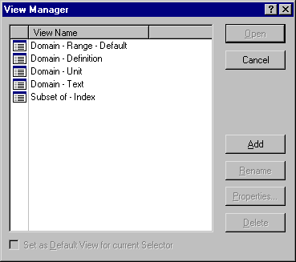

.. _Identifier-Selector_Managing_the_View_Definitions:

Manage the View Definitions
===========================

**Description** 

A View Definition defines which identifier attributes are displayed as the columns of a View Window. You can create, delete and modify these View Definitions from within the same View Manager dialog box that is used for selecting a View Definition (via the Open with command).

|img_def_view_Manager_dialog_bmp| 

For managing the presented list of view definitions, you can click one of the buttons at the right:

*	Add: Creates a new View Definition in the list. The system responds with an edit field in which you should enter a name for this newly created item.
*	Rename: Allows you to change the name of the currently selected View Definition.
*	Properties…: Opens a dialog box in which you can specify which attributes should appear as the columns of the View Window.
*	Delete: Deletes the currently selected View Definition.

**Remark** 

The option "Set as Default View for current Selector" is only available if the View Manager is called from within the Identifier Selector tool.

**Learn more about** 

*	:ref:`Identifier-Selector_Identifier_Selector`  

