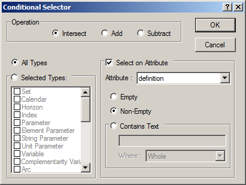

.. _Identifier-Selector_View_Definition_Properties:

View Definition Properties
==========================

**Description** 

In the dialog box View Definition Properties you can specify which attributes should appear as the columns of a View Window.

|img_def_view_Properties_dialog_bmp| 

The list box "Selected Attributes" shows the currently selected attributes and the order (from left to right) in which they appear in a View Window. You can use the four small buttons to re-arrange this list:

|img_def_View_Definition_Move_button_bmp| 	This inserts the highlighted attribute from the "Available Attributes" into the "Selected Attributes".

|img_def_View_Definition_Delete_button_bmp| 	This removes the highlighted attribute from the "Selected Attributes".

|img_def_View_Definition_Up_button_bmp| 

|img_def_View_Definition_Down_button_bmp| 	These buttons let you change the order of the "Selected Attributes".

**Note** 

*	In this dialog box you can only define which attributes you want to view, and in which order. If you want to define the width of a column, then you should open the View Window, modify the column widths, and then save the View Definition.

**Tips & Tricks** 

*	If you double-click on an item in the list of "Available Attributes", it is inserted into the "Selected Attributes".
*	If you double-click on an item in the list of "Selected Attributes", it is removed from the list.

