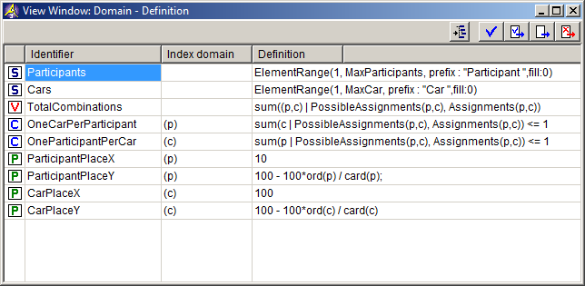

.. _Identifier-Selector_View_Window:

View Window - Introduction
==========================

**Description** 

A View Window allows you to view one (or more) attributes simultaneously for a number of identifiers. The window is presented in the form of a table, where each row represents an identifier and each column represents a specific attribute. A cell in the table thus displays a specific attribute value of an identifier.

|img_def_View_Window_example_bmp| 

Because a View Window has a tabular format with rows, columns and cells, the changes that you can make in a View Window can also be divided into these three categories:

*	You can change the collection of rows by adding and removing identifiers or by changing the order of the identifiers.
*	You can change the collection of columns by adding and removing attributes, changing their order or changing the width of each column.
*	You can change the contents of cell, which means that you are changing attribute values.

Because some commands are applicable for both rows and cells (for example Delete) you should make sure that you select the correct item in the View Window before applying a command

**Note** 

*	The buttons at the right top corner of a View Window have the same functionality as the buttons on an Attribute Form of an identifier.
*	Changing the collection of rows or columns in a View Window does not influence the model itself. It only effects the layout of your current View Window. For example, deleting a row does not correspond to deleting an identifier from your model.

**How to…** 

*	:ref:`Identifier-Selector_Selecting_rows_or_cells_in_a_v`  
*	:ref:`Identifier-Selector_Changing_the_columns_of_a_View`  
*	:ref:`Identifier-Selector_Changing_the_rows_of_a_View_Wi`  
*	:ref:`Identifier-Selector_Making_Data_Changes_in_a_View_`  

**Learn more about** 

*	:ref:`Model-Explorer_Attribute_Form_Manipulation`  

