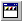

.. _Menu-Builder_Creating_a_Tool_Bar:

Create a Tool Bar
=================

To create a Toolbar:

1.	Open the Menu Builder.

2.	Select an existing node below which you want to insert a new toolbar.

3.	From the Edit menu, select New - Toolbar |img_def_Toolbar_Button_bmp|.

4.	Specify the name for the new toolbar.

5.	Press the ``<Enter>``  key (or press the ``<Esc>``  key to abort the operation).

After you have created the toolbar node, you can add the toolbar buttons by creating new menu items as children of this node, or, better, create duplicates from existing menu item nodes.

**Note** 

*	A Toolbar node can only be placed as child of the root node, or as a child of a Section node.
*	The name of a toolbar is not visible in the end-user application, it is only used in the Menu Builder and for referencing the toolbar from within a page.
*	In AIMMS a toolbar may contain menu items that are not part of the menubar associated with that page.

**How to …** 

*	:ref:`Menu-Builder_Creating_a_menu_item`  
*	:ref:`Menu-Builder_Specifying_your_own_bitmap_on_`  

**Learn more about** 

*	:ref:`Menu-Builder_Menu_Bars`  
*	:ref:`Menu-Builder_Popup_menus`  

