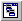

.. _Menu-Builder_Creating_a_menu_bar:

Create a menu bar
=================

To create a Menubar node:

1.	Open the Menu Builder.

2.	Select an existing node below which you want to insert a new menubar.

3.	From the Edit menu, select New - Menubar |img_def_Menubar_Button_bmp|.

4.	Specify the name for the new menubar.

5.	Press the ``<Enter>``  key (or press the ``<Esc>``  key to abort the operation).

After you have created the menubar node, you can further specify the menubar by adding popup menus as children of this node.

**Note** 

*	A Menubar node can only be placed as child of the root node, or as a child of a Section node.
*	The name of a menubar is not visible in the end-user application, it is only used in the Menu Builder and for referencing the menubar from within a page.
*	You will receive a warning message when you want to delete a menubar node that is referenced on a page.

**Learn more about** 

*	:ref:`Menu-Builder_Tool_bars`  
*	:ref:`Menu-Builder_Popup_menus`  

