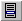

.. _Menu-Builder_Creating_a_popup_menu:

Create a popup menu
===================

To create a new popup menu node:

1.	Open the Menu Builder.

2.	Select an existing node below which you want to insert a new popup menu.

3.	From the Edit menu, select Insert - Popup Menu |img_def_Popup_Menu_Button_bmp|.

4.	Specify the name for the new popup menu.

5.	Press the ``<Enter>``  key (or press the ``<Esc>``  key to abort the operation).

After you have created the popup menu node, you can add menu commands or submenus to it by adding menu item nodes or other popup menu nodes as children of this node.

**Note** 

*	A Popup menu node can only be positioned as child of a menu bar, another popup menu, the root node, or a section node.
*	If a Popup is defined as child of the root node or a section node, then you can only use that Popup menu as a right-mouse popup menu. However, a popup menu that is created as part of an existing menubar of popup menu can be selected for a right-mouse popup menu as well.
*	If you use a popup menu only as a right-mouse popup menu (and not as part of a menubar or submenu in another menu), then the name of the node is not visible in the end-user application. It is then only used in the Menu Builder and for referencing it from within a page or page object.
*	If you insert an ampersand character ('&') in the name of the popup menu (for example: &File), then the character directly following this ampersand is used as a shortcut key. If the popup menu is used in a menubar, the shortcut character will be underlined (for example File), and you can then access this menu from your keyboard by pressing the ``<Alt>`` key in combination with the underlined character (for example: ``<Alt>-<f>``).

**How to …** 

*	:ref:`Menu-Builder_Creating_a_menu_item`  

**Learn more about** 

*	:ref:`Menu-Builder_Menu_Bars`  
*	:ref:`Menu-Builder_Tool_bars`  

