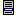
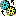
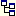

.. |img_def_Root_Node_Closed_bmp| image:: images/Root_Node_Closed.bmp

.. |check_mark| unicode:: U+2713
   :trim:

.. _Menu-Builder_Nodes_in_the_Menu_Tree:

Nodes in the Menu Tree
======================

**Description** 

The Menu Tree can contain different types of nodes, each representing a specific menu component. These node types are:

*	|img_def_Menubar_bmp| Menubar nodes, to define menubars,
*	|img_def_Toolbar_Node_bmp| Toolbar nodes, to define toolbars,
*	|img_def_Popup_Menu_bmp| Popup menu nodes, to define popup menus,
*	|img_def_Execution_Section_bmp| Menu item nodes, to define menu or toolbar actions,
*	|img_def_Navigation_Object_bmp| Page navigation nodes, to define a set of menu items at once that allow the end-user to navigate through pages, and
*	|img_def_Separator_bmp| Separator nodes, to define separator lines (in popup menus) or separator spaces (on toolbars).

In addition to these nodes that are closely related to the components of a menu(bar) or toolbar, two other types of nodes are only used for structuring the Menu Tree itself. These structuring nodes are: 

*	|img_def_Root_Node_Closed_bmp| a project or library root node, and
*	|img_def_Section_Node_Closed_bmp| Section nodes, to group the menubars, toolbars and popup menus that you create.

The following table shows the allowed parent-child relations in the Menu Tree.

.. list-table::

   * - Parent Child
     - Root
     - Section
     - Menubar
     - Toolbar
     - Popup Menu
   * - Section
     - |check_mark|
     - |check_mark|
     - 
     - 
     - 
   * - Menubar
     - |check_mark|
     - |check_mark|
     - 
     - 
     - 
   * - Toolbar
     - |check_mark|
     - |check_mark|
     - 
     - 
     - 
   * - Popup menu
     - |check_mark|
     - |check_mark|
     - |check_mark|
     - 
     - |check_mark|
   * - menu item
     - 
     - 
     - 
     - |check_mark|
     - |check_mark|
   * - Navigator
     - 
     - 
     - 
     - 
     - |check_mark|
   * - Separator
     - 
     - 
     - 
     - |check_mark|
     - |check_mark|

**Note** 

*	As follows from the table describing the parent-child relations, menu items, page navigation and separator nodes are always leaf nodes in the Menu Tree.
*	A menu item can be positioned as a child of a popup menu or as a child of a toolbar. As part of a popup menu, a menu item appears as a command in the menu. As part of a toolbar, a menu item appears as a button on the toolbar.
*	Usually, a toolbar button relates to a specific command in the menu. In the Menu Builder, you can easily achieve this by creating a duplicate of the menu item, and position this duplicate as child of the toolbar node. Using a duplicate instead of a copy improves the maintainability of the Menu Tree.

**Learn more about** 

*	:ref:`Menu-Builder_Menu_node_properties`  

