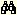

.. _Miscellaneous_Drag_Drop_in_AIMMS_Trees:

Drag & Drop in AIMMS Trees
==========================

**Description** 

Between the seven available AIMMS tools, drag & drop support is implemented. Drag and drop commands are activated by dragging a node selection from one position in the tree to another position (in the same or even another tree) while holding the left mouse button down.

The available drag & drop features can be divided into the following four categories.

*	Copy (C) support, indicated in AIMMS by a |img_def_Cursor_Copy_bmp| cursor. The copy command is activated by holding down the ``<Ctrl>``  key while dragging.
*	Move (M) support, indicated in AIMMS by a |img_def_Cursor_Move_bmp| cursor.
*	Find (F) support, indicated in AIMMS by a |img_def_Cursor_Find_bmp| cursor. The find command is activated by holding down the ``<Ctrl>``  and ``<Shift>``  key simultaneously while dragging
*	Add Into (A) support, indicated in AIMMS by a |img_def_Cursor_Add_Into_bmp| cursor.

**Tips & Tricks** 

*	To find all duplicate nodes of a certain node, select the node and drag the node somewhere in the same tree while holding down the ``<Ctrl>``  and ``<Shift>``  key simultaneously.

The following table describes the availability of drag & drop features between every two AIMMS tools.

.. list-table::

   * -          tofrom
     - ModelExplorer
     - Identifier Selector
     - PageManager
     - TemplateManager
     - MenuBuilder
   * - Model Explorer
     - CMF
     - A
     - F
     - F
     - F
   * - Identifier Selector
     - F
     - CMF
     - F
     - F
     - F
   * - Page Manager
     - 
     - 
     - CMF
     - MF
     - F
   * - Template Manager
     - 
     - 
     - MF
     - CMF
     - F
   * - Menu Builder
     - 
     - 
     - F
     - F
     - CMF

 

C	copy support

M	move support

F	find support

A	add into support

