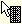

.. _Miscellaneous_Right_Mouse_Support_in_AIMMS_T:

Right Mouse Support in AIMMS Trees
==================================

**Description** 

When pressing the right mouse AIMMS will pop up a menu containing the most common (edit) actions that can be applied to the current node selection. 

When dragging the right mouse, AIMMS will display a |img_def_Cursor_Right_Mouse_Menu_bmp| cursor. When the mouse button is released a menu will pop up containing the most common (drag & drop) actions that can be applied to the current node selection.

**Learn more about** 

*	:ref:`Miscellaneous_Node_Selections_in_AIMMS_Trees`  
*	:ref:`Miscellaneous_Cut_Copy_and_Paste_in_AIMMS_Tr`  
*	:ref:`Miscellaneous_Drag_Drop_in_AIMMS_Trees`  

