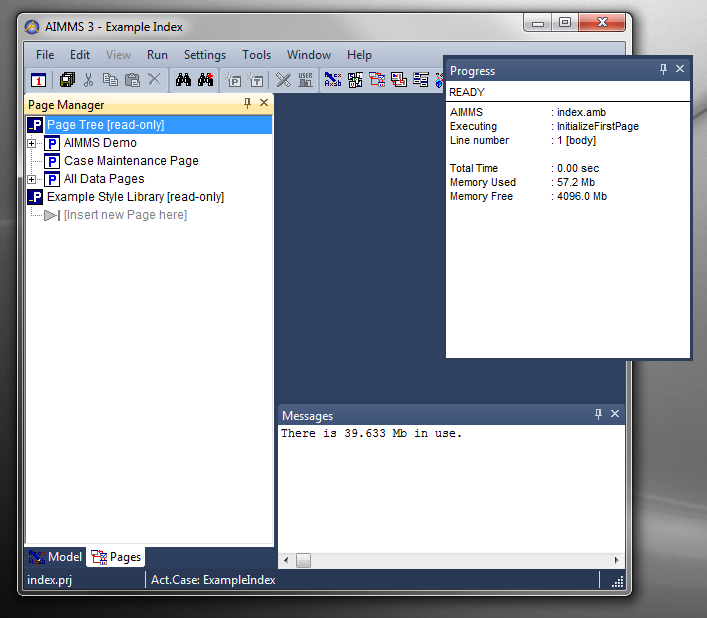

.. _Miscellaneous_Docking_and_Floating_Windows:

Docking and Floating Windows
============================

The AIMMS IDE allows you to dock certain windows at the top, bottom, left or right side of the main window, or even as floating windows whose positions are not restricted by the size and position of the main window.

In the picture below you see the Model Explorer and Page Manager docked together at the left, the Message window docked at the bottom and the Progress window as a floating window.

Not all type of windows within AIMMS can be docked like this. In general, the windows that can be docked, are the 'Tool' windows, for which it makes more sense to have them open for a longer time.

Attribute windows (for editing the model identifiers) and the GUI Pages, which are usually opened only for a relatively brief period, are not dockable, and appear in the 'document area' (which is the empty blue area in the picture below).

For some pages that you create, it might be useful to your end-user to have these appear as docking pages, and for that the Page Properties do allow you to mark a page as dockable (See :ref:`Page-Manager_Making_a_Page_dockable` ).

While working with the IDE, you can position the dockable windows at any position you like, by dragging them around. While dragging, special indicators appear that help in positioning the windows at the right spot.

When you close a project, AIMMS can store the current layout of all the docked windows, such that when you re-open the project all windows automatically reappear at the same positions. (See :ref:`Miscellaneous_Saving_and_Restoring_Layouts` .

|img_def_SomeLayout_png|

