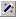
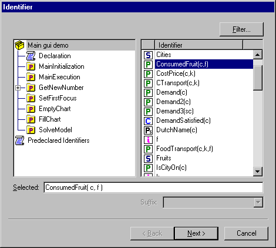
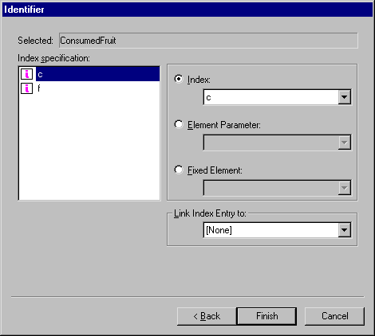

.. _Miscellaneous_Identifier_Selection_Dialog_Bo:

Identifier Selection Dialog Box
===============================

**Description** 

In the property dialog boxes and the attribute forms, you often need to specify the name of an identifier (in combination with specifications for the index domain). 
For example: ``Cities``, ``ConsumedFruit(c,f)``, ``Demand('Amsterdam')``, etc. 
You can type these names yourself, but it is often much easier to specify the identifier using the Identifier Selection dialog box. 
Usually, you can access this dialog box using the small |img_def_Wizard_button_bmp| button.

The Identifier Selection dialog box consists of two pages: on the first page you can select the identifier, 
on the second page you can make changes to the index domain of the selected identifier. 
The second page of the Identifier Selection dialog box is not always shown 
(for example if the identifier is a scalar identifier, or if somehow the index domain is not relevant).

The figure below shows the first page of the Identifier Selection dialog box.

|img_def_Identifier_Selection_Dialog_example_1_bmp| 

On this first page of the Identifier Selection dialog box, you can either select an identifier, or in case you are developing your GUI, you can enter an expression.

**Selecting an identifier** 

When you decide to select one of the identifiers from your model (or a predeclared identifier), 
you can either select the identifier in the list box at the right, or 
you can simply type the name in the edit field at the bottom. 
When you are typing a name, the list box will try to select the identifier that matches your typed string. 
To help you in finding a specific identifier in the list box, the dialog box offers the following handy mechanisms:

*	If you select a node from the tree at the left-side of the dialog box, the list box at the right will only contain the identifiers that are declared in that part of your model.
*	You can click in the header bar of the list box, you can sort the identifiers on type or on name.
*	If you click the Filter button, a menu appears in which you can select a subset of identifier types that you want to select from. Note that in many cases, AIMMS itself already uses a filter on the identifier types, because the context from where you accessed the Identifier Selection dialog box allows only specific identifier types. For example, if you want to specify an upper bound in the Range wizard, the Identifier Selection dialog box will only list the numerical paramaters in your model.

In some situations, the context from where you access the dialog box allows you to specify one of the special suffix values of an identifier (for example the ``.Lower``  or ``.Upper``  of a variable). You can select the specific suffix in the Suffix drop-down list.

**Entering an Expression** 

If you want to specify an expression, you should select <expression> at the top of the list. After typing next a second dialog will be opened letting you specify an identifier. An expression can be of one of tree types, Numeric, Element-valued or String-valued. An expression can have an index domain. The definition can contain any AIMMS code that is allowed as the definition of an identifier.

If you have selected the identifier or expression in this first page of the Identifier Selection dialog box, the buttons at the bottom of the dialog box will either contain a Next > button or a Finish button. This depends on whether or not you need to make additional specifications for the domain of the identifier. If the Next > button is available, pressing this button will switch to the second page of the Identifier Selection dialog box (as illustrated below).

|img_def_Identifier_Selection_Dialog_example_2_bmp| 

On this second page of the Identifier Selection dialog box, you specify alternatives for each index in the domain of the selected identifier. Per index you can:

*	Select an alternative index (in the same set, a subset or a superset).
*	Specify a slice of the identifier by fixing the index to the current value of an element parameter.
*	Specify a slice of the identifier by fixing the index to a specific element.

In some situations, AIMMS also allows you to specify a Reverse Link for an index. A Reverse Link (to a scalar element parameter) is used in a page object to propagate the current selection in that object: if the user selects an item in the object, the value of the linked scalar element parameter will be set to the corresponding set element. This mechanism offers you the possibility to link objects (i.e. the contents of one object, depends on the current selection in another object). In the string that is constructed by the Identifier Selection dialog box, a reverse link is represented using an arrow: '``->`` ', for example: ``Demand( c -> SelectedCity )``.

**Note** 

*	When specifying an identifier for a Table object, in the second page of the Identifier Selection dialog box. you can also change the order of the indices, and indicate which indices should be used for the rows and which indices for the columns in the table.
*	When specifying identifiers for a Scalar object, in the first page of the Identifier Selection dialog box, you can select multiple scalar identifiers at once. At the top of the page an extra checkbox Multiple Selection is presented. If you select this checkbox, the list box will only display the scalar identifiers and you can then select multiple entries from the list box (using the ``Shift``  or ``Ctrl``  key).
*	When specifying the slice of the identifier by fixing the index to a specific element, only the first 32767 elements are shown in the dropdown list.
*	In some cases, for example when selecting an identifier for a Scalar page object, you can also type a quoted text instead of selecting an identifier.

**Learn more about** 

*	:ref:`Miscellaneous_Linking_Objects`  

