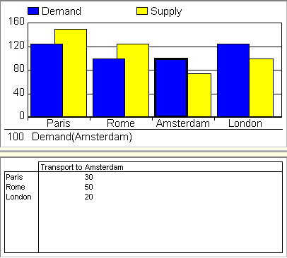
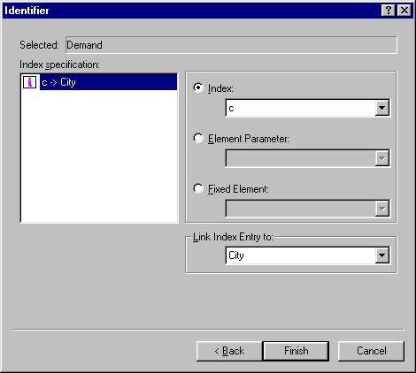
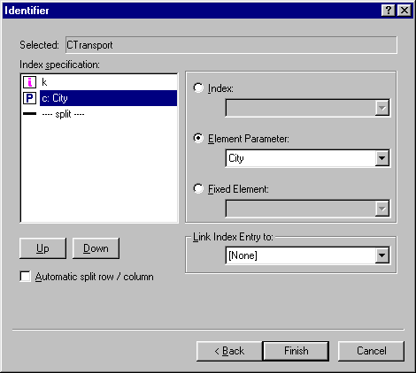

.. _Miscellaneous_Linking_Objects:

Linking Objects
===============

**Description** 

The identifier selection options offers you the capability to establish a link between a (scalar) element parameter and the current index value selected by an end-user. 

You can use AIMMS' capabilities of index linking in several manners. Assume that one or more indices in the current data object are linked to element parameters, and that these element parameters are used in other data objects. Then the end-users can see slices of data in these other data objects that correspond to the selected index combination in the current data object. In addition, you can keep track of the currently selected data field in an object when executing a procedure. This allows you to do data processing or error checking for just the relevant tuple in a multidimensional identifier.

**Example** 

In the example below you can see that a selection in a bar chart results in additional information in the table below the bar chart for the element selected in the bar chart, in this case, the city of Amsterdam.

|img_def_Object_Link_Example_3_bmp|

The index over parameter Demand is linked to the element parameter City. This means that whenever you select a demand bar in the bar chart, the element of the City, in this case Amsterdam, will be assigned to City.

|img_def_Object_Link_example_1_bmp| 

At the index specification of the transport parameter, the element paramater City is selected.

|img_def_Object_Link_example_2_bmp| 

