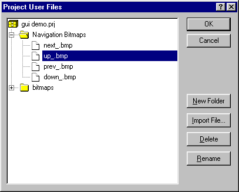

.. _Miscellaneous_User_Files_in_the_Project_File:

User Files in the Project File
==============================

**Description** 

Besides the standard files that define a project (such as the model file, the page files, etc) a project usually needs some other user-defined files to work properly. The most common examples of these user files are the picture files that are needed in the pages of your interface. You can keep (and distribute) these files as separate files, but you can also include these files in the project file itself. This feature has the advantage that your end-user cannot accidentally delete or overwrite one of these files, and the number of files that you have to distribute along with your project is limited.

If you select Project User Files from the Tools menu, the Project User Files dialog box appears. In this dialog box you can import user files into the project, delete user files, and organize the user files in a directory-like structure.

|img_def_Select_Bitmap_File_dialog_bmp|

You should use the special prefix "<prj>:" to refer to a user file in the project. For example if your project contains a user file logo.bmp in the directory bitmaps, then you should refer to this file via: <prj>:bitmaps\logo.bmp

In the property dialog boxes where you can enter a bitmap file, the wizard usually allows you to select either a bitmap file directly from disk or from the project file.

**Note** 

*	If you want to edit any of the project user files, then you first have to export it to a normal disk file, make the modifications, and then re-import the file.
*	If you use the Localization feature of AIMMS, then the files containing the strings for each separate language are stored as Project User files. These files are placed in the subdirectory localization.

