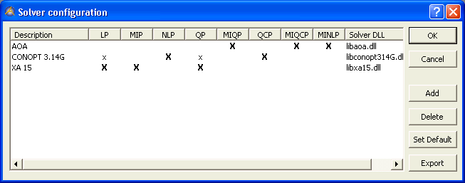
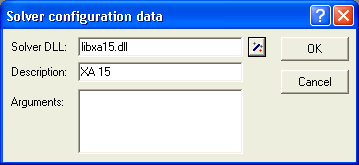

.. _Miscellaneous_Solver_Configuration:

Solver Configuration
====================

**Description** 

With every AIMMS system you can obtain a license to use particular solvers for solving mathematical programs of a specific type. As AIMMS provides a standardized interface to its solvers, it is even possible for you to link you own solver to AIMMS. 

You can get an overview of the list of solvers currently known to your AIMMS system through the Solver Configuration dialog box. In this dialog box all available solvers are listed (in alphabetic order) along with the model types they can handle. A solver appears as a row and an 'x' is placed in the column of each model type that the solver can handle. A bold 'X' indicates that the solver is the default solver for the corresponding model type. Note that the Solver Configuration dialog box is a user resizable dialog box that gets its size from the previous time it had been opened. 

|img_def_Solver_configuration_32_bmp| 

The buttons on the right-hand side of the dialog box let you globally modify the solver configuration of your AIMMS system. Through these buttons you can perform tasks such as:

*	change the default solver for a particular type and
*	add or delete solvers

Clicking the Add button will open the Solver Configuration Datadialog box.

|img_def_solver_configuration_data_32_bmp| 

You can export the solver configuration to a local project file with name 'solvers.slv' by clicking the Export button. See the :ref:`Miscellaneous_Solver_Configuration_File`  for more information.

**Note** 

*	By modifying the value of the predefined element parameter ``CurrentSolver``  into the predefined ``AllSolvers``  during run time, you can at any time during the execution of your model select the LP solver that you want AIMMS to use during the next SOLVE statement of a linear program. At startup, AIMMS will set CurrentSolver[ 'LP' ] equal to the default LP solver selected in the Solver Configuration dialog box; set CurrentSolver[ 'MIP' ] equal to the default MIP solver, etc.
*	AIMMS only displays the model types for which a solver is available that can handle it.
*	The information displayed in the Solver Configuration dialog box is read from and written to the solver configuration file.

**How to ...** 

*	:ref:`Miscellaneous_Opening_the_Solver_Configurati`  
*	:ref:`Miscellaneous_Changing_the_Default_Solver`  
*	:ref:`Miscellaneous_Adding_a_Solver`  
*	:ref:`Miscellaneous_Deleting_a_Solver`  
*	:ref:`Miscellaneous_Solver_Configuration_File`  

