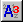

.. |img_def_Wizard_button_bmp| image:: images/Wizard_button.bmp

.. _Model-Explorer_Attribute_Form_Manipulation:

Attribute Form Manipulation
===========================

**Description** 

By double clicking on the name of any node in the Model Tree, the attribute form of that node is displayed. The attribute form contains all node attributes that together specify the node in more detail. To reduce the amount of syntax knowledge required to set up your model, AIMMS is equipped with attribute wizards that help you fill in the attribute form.

From within the attribute form you can

*	Inspect the current data of the identifier by using the Show Data button |img_def_Show_Data_button_bmp|.
*	Navigate further through the Model Tree by using the parent |img_def_Model_Explorer_Parent_button_bmp|, previous |img_def_Model_Explorer_Previous_button_bmp| and next |img_def_Model_Explorer_Next_button_bmp| attribute window buttons
*	Find the position of the identifier within the Model Tree by using the tree position button |img_def_Model_Explorer_Location_button_bmp|.
*	Invoke attribute wizards by clicking on the wizard button |img_def_Wizard_button_bmp| in front of the attribute for which you want some help.

Having made changes to the attribute form, you can

*	|img_def_Model_explorer_Check_button_bmp| Check the attribute form. AIMMS will check the syntax of all the attributes on the attribute form and (if correct) apply them to the model.
*	|img_def_Model_Explorer_Check_and_Close_button_bmp| Check and leave the attribute form. AIMMS will check the syntax of all attributes on the attribute form and (if correct) apply them to the model and close the attribute form.
*	|img_def_Model_Explorer_Apply_without_Checking_button_bmp| Apply changes without checking the attribute form. AIMMS will apply the changes without checking the syntax of the attributes. This is especially useful if one or more of the changed attributes contain references to model identifiers that are still to be declared.
*	|img_def_Model_Explorer_Cancel_button_bmp| Cancel all changes. AIMMS will cancel all changes and close the attribute form.

**Tips & Tricks** 

*	Via the Context Help, or the Help on command in the right-mouse popup menu you can request for language specific help. This help will guide you to the relevant position in the Language Reference.

**Learn more about** 

*	:ref:`Model-Explorer_Attribute_Wizards`  
*	:ref:`Miscellaneous_Name_Completion`  

