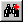
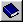
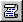
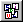
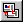
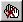

.. |img_def_First_Page_button_bmp| image:: images/First_Page_button.bmp
.. |img_def_Save_All_button_bmp| image:: images/Save_All_button.bmp

.. |img_def_Copy_Button_bmp| image:: images/Copy_Button.bmp
.. |img_def_Paste_button_bmp| image:: images/Paste_button.bmp
.. |img_def_Remove_button_Model_Tree_bmp| image:: images/Remove_button_Model_Tree.bmp
.. |img_def_Find_button_bmp| image:: images/Find_button.bmp

.. |img_def_Properties_button_bmp| image:: images/Properties_button.bmp

.. |img_def_Model_Explorer_button_bmp| image:: images/Model_Explorer_button.bmp

.. |img_def_Page_Manager_button_bmp| image:: images/Page_Manager_button.bmp

.. _Model-Explorer_Model_Explorer_-_Toolbar:

Toolbar
=======

**Description** 

The Model Explorer is equipped with a non-default Toolbar.

From this Toolbar, you can choose the following actions:

*	|img_def_First_Page_button_bmp| :ref:`option-AIMMS-startup_page` 

*   |img_def_Save_All_button_bmp| :ref:`Miscellaneous_Saving_a_Project`  

*	|img_def_Cut_button_bmp| :ref:`Miscellaneous_Cut_Copy_and_Paste_in_AIMMS_Tr`  
*	|img_def_Copy_Button_bmp| :ref:`Miscellaneous_Cut_Copy_and_Paste_in_AIMMS_Tr`  
*	|img_def_Paste_button_bmp| :ref:`Miscellaneous_Cut_Copy_and_Paste_in_AIMMS_Tr`  
*	|img_def_Remove_button_Model_Tree_bmp| :ref:`Miscellaneous_Cut_Copy_and_Paste_in_AIMMS_Tr`  
*	|img_def_Find_button_bmp| :ref:`Miscellaneous_Find__Replace`  
*	|img_def_Find_Again_button_bmp| :ref:`Miscellaneous_Find__Replace`  
*	|img_def_Properties_button_bmp| :ref:`Model-Explorer_Attribute_Forms`  
*	|img_def_New_Section_button_bmp| :ref:`Model-Explorer_Creating_New_Nodes`  
*	|img_def_New_Declaration_Section_button_bmp| :ref:`Model-Explorer_Creating_New_Nodes`  
*	|img_def_New_Procedure_button_bmp| :ref:`Model-Explorer_Creating_New_Nodes`  
*	|img_def_New_Function_button_bmp| :ref:`Model-Explorer_Creating_New_Nodes`  
*	|img_def_New_Set_button_bmp| :ref:`Model-Explorer_Creating_New_Nodes`  
*	|img_def_New_Parameter_button_bmp| :ref:`Model-Explorer_Creating_New_Nodes`  
*	|img_def_New_Variable_button_bmp| :ref:`Model-Explorer_Creating_New_Nodes`  
*	|img_def_New_Constraint_button_bmp| :ref:`Model-Explorer_Creating_New_Nodes`  
*	|img_def_New_Identifier_Node_button_bmp| :ref:`Model-Explorer_Creating_New_Nodes`  / :ref:`Model-Explorer_Creating_New_Nodes` 
*	|img_def_Model_Explorer_button_bmp| :ref:`Model-Explorer_Model_Explorer_-_Introduction`  
*	|img_def_Identifier_Selector_button_bmp| :ref:`Identifier-Selector_Identifier_Selector`  
*	|img_def_Page_Manager_button_bmp| :ref:`Page-Manager_Page_Manager_Introduction`  
*	|img_def_Template_Manager_button_bmp| :ref:`Template-Manager_Template_Manager_Introduction`  
*	|img_def_Menu_Builder_button_bmp| :ref:`Menu-Builder_Menu_Builder_Introduction`  

If the debugger is activated, the Model Explorer is also equipped with the debugger toolbar.

From this toolbar, you can choose the following actions:

*	|img_def_debugger_go_bmp| :ref:`Diagnostic-Tools_Stepping_through_the_Execution`  
*	|img_def_debugger_finish_bmp| :ref:`Diagnostic-Tools_Stepping_through_the_Execution`  
*	|img_def_Debugger_step_bmp| :ref:`Diagnostic-Tools_Stepping_through_the_Execution`  
*	|img_def_Debugger_step_into_bmp| :ref:`Diagnostic-Tools_Stepping_through_the_Execution`  
*	|img_def_Debugger_step_out_bmp| :ref:`Diagnostic-Tools_Stepping_through_the_Execution`  
*	|img_def_Debugger_run_to_current_bmp| :ref:`Diagnostic-Tools_Stepping_through_the_Execution`  
*	|img_def_Debugger_halt_execution_bmp| :ref:`Diagnostic-Tools_Stepping_through_the_Execution`  
*	|img_def_Debugger_show_current_statement_bmp| :ref:`Diagnostic-Tools_Stepping_through_the_Execution`  
*	|img_def_Debugger_show_call_stack_bmp| :ref:`Diagnostic-Tools_Stepping_through_the_Execution`  
*	|img_def_Debugger_insert_breakpoint_bmp| :ref:`Diagnostic-Tools_Setting_a_Breakpoint`  
*	|img_def_Debugger_remove_all_breakpoints_bmp| :ref:`Diagnostic-Tools_Viewing_and_Modifying_Breakpoi`  
*	|img_def_Debugger_disable_all_bmp| :ref:`Diagnostic-Tools_Viewing_and_Modifying_Breakpoi`  
*	|img_def_Debugger_view_all_bmp| :ref:`Diagnostic-Tools_Viewing_and_Modifying_Breakpoi`  

**Remark** 

When you are in debug mode, the debug toolbar will also be visible in all other AIMMS tools. Although you will often only use it while using the model explorer, you may sometimes want to use it while in other tools. It is also a way of showing you that the debugger is still active.

**Learn more about** 

*	:ref:`Menu-Builder_Tool_bars`  
*	:ref:`Model-Explorer_Model_Explorer_-_Introduction` 

