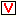

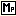
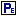
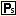
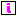

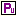
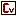

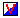
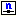

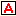
.. |img_def_Identifier_File_bmp| image:: images/Identifier_File.bmp

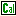

.. _Model-Explorer_Identifier_Nodes:

Identifier Nodes
================

**Description** 

The most frequent type of node in the Model Tree is the identifier declaration node. All identifiers of your model are visible in the Model Explorer as leaf node in declaration sections. Identifier declarations are not allowed outside of declaration sections. AIMMS supports several identifier types that are all represented by a different icon.

The identifier types that are supported by AIMMS are

*	|img_def_Identifier_Set_bmp| :ref:`Model-Explorer_Creating_a_Set`  
*	|img_def_Identifier_Parameter_bmp| :ref:`Model-Explorer_Creating_a_Parameter`  
*	|img_def_Identifier_Variable_bmp| :ref:`Model-Explorer_Creating_a_Variable`  
*	|img_def_Identifier_Constraint_bmp| :ref:`Model-Explorer_Creating_a_Constraint`  
*	|img_def_Identifier_Mathematical_Program_bmp| :ref:`Model-Explorer_Creating_a_Mathematical_Progra`  
*	|img_def_Identifier_Element_Parameter_bmp| :ref:`Model-Explorer_Creating_an_Element_Parameter`  
*	|img_def_Identifier_String_Parameter_bmp| :ref:`Model-Explorer_Creating_a_String_Parameter`  
*	|img_def_Identifier_Index_bmp| :ref:`Model-Explorer_Creating_an_Index`  
*	|img_def_Identifier_Quantity_bmp| :ref:`Model-Explorer_Creating_a_Quantity`  
*	|img_def_Identifier_Unit_Parameter_bmp| :ref:`Model-Explorer_Creating_a_Unit_Parameter`  
*	|img_def_Identifier_Convention_bmp| :ref:`Model-Explorer_Creating_a_Convention`  
*	|img_def_Identifier_Arc_bmp| :ref:`Model-Explorer_Creating_an_Arc`  
*	|img_def_Identifier_complementarity_variable_bmp| :ref:`Model-Explorer_Creating_a_Complementarity_Var`  
*	|img_def_Identifier_Node_bmp| :ref:`Model-Explorer_Creating_a_Node`  
*	|img_def_Identifier_Macro_bmp| :ref:`Model-Explorer_Creating_a_Macro`  
*	|img_def_Identifier_Assertion_bmp| :ref:`Model-Explorer_Creating_an_Assertion`  
*	|img_def_Identifier_File_bmp| :ref:`Model-Explorer_Creating_a_File`  
*	|img_def_Identifier_Database_Table_bmp| :ref:`Model-Explorer_Creating_a_Database_Table`  
*	|img_def_Identifier_Horizon_bmp| :ref:`Model-Explorer_Creating_a_Horizon`  
*	|img_def_Identifier_Calendar_bmp| :ref:`Model-Explorer_Creating_a_Calendar`  

