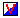

.. |img_def_Wizard_button_bmp| image:: images/Wizard_button.bmp

.. _Model-Explorer_Creating_a_Complementarity_Var:

Creating a Complementarity Variable
===================================

**Description** 

To create a new complementarity variable in the Model Tree:

1.	Select the position in a Declaration Section where the new complementarity variable should be inserted

2.	From the Edit menu select Insert – Other – Complementarity Variable |img_def_Identifier_Complementarity_Variable_bmp|

3.	Enter a name for the new complementarity variable (if you are creating a multi-dimensional complementarity variable, you can type the indices of each dimension as well)

4.	Press ``<Enter>``  to create the new complementarity variable (or press ``<Esc>``  to abort the operation)

The newly created complementarity variable is not yet ready for use, because you should at least specify its Complement via the attributes. To modify the attributes of the newly created complementarity variable:

*	Press ``<Enter>``  or double click on the complementarity variable node.

The most commonly used attributes of a complementarity variable are discussed below. 

*	``INDEX DOMAIN``  : The ``INDEX DOMAIN``  attribute should be specified in order to declare indexed complementarity variables. The |img_def_Wizard_button_bmp| wizard will display the Set Dependency Tree of your model and allows you to select one or more indices.
*	``RANGE``  : The ``RANGE``  attribute should be specified in order to restrict the values to certain intervals. The |img_def_Wizard_button_bmp| wizard will let you either select one of the predefined ranges, like ``Real`` , ``Nonnegative`` , ``Nonpositive`` , ``Integer`` , or ``Binary`` , or specify a (parametric) interval range.
*	``UNIT``  : The ``UNIT``  attribute is used to specify the unit in which the complementarity variable's value is measured. By specifying a unit, AIMMS is able to perform automatic unit conversions and unit consistency checks. The |img_def_Wizard_button_bmp| wizard will let you select a unit and quantity from the list made up from your model quantities and units together with the information in the AIMMS SI unit base.
*	``DEFAULT``  : The ``DEFAULT``  attribute should be used in order to specify a nonzero default value for the complementarity variable. Note that AIMMS will explicitly store all values that are non-default. 
*	``PROPERTY`` : The ``PROPERTY``  attribute should be used to specify additional properties. Note that in case of a complementarity variable only the NoSave property can be set..
*	``COMPLEMENT`` : The mandatory ``COMPLEMENT``  attribute for complementarity variables should be used to specify the complement.

**Learn more about** 

*	Search for Complementarity variables (Language Reference)
*	:ref:`Model-Explorer_Attribute_Forms`  
*	:ref:`Model-Explorer_Attribute_Form_Manipulation`  
*	Search for AIMMS Update Mechanism (Language Reference)

