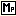

.. |img_def_Wizard_button_bmp| image:: images/Wizard_button.bmp

.. _Model-Explorer_Creating_a_Mathematical_Progra:

Creating a Mathematical Program
===============================

**Description** 

To create a new mathematical program in the Model Tree:

1.	Select the position in a Declaration Section where the new mathematical program should be inserted

2.	From the Edit menu select Insert – Other (or press the ``<Insert>``  key)

3.	In the dialog box select |img_def_Identifier_Mathematical_Program_bmp| Mathematical program and press OK

4.	Enter a name for the new mathematical program

5.	Press ``<Enter>``  to create the new mathematical program (or press ``<Esc>``  to abort the operation)

The newly created mathematical program is not yet ready for use, because you have to specify some mandatory attributes. To modify the attributes of the newly created mathematical program:

*	Press ``<Enter>``  or double click on the mathematical program.

The most commonly used attributes of a mathematical program are discussed below. 

*	``OBJECTIVE``  : The ``OBJECTIVE``  attribute defines the variable that should be optimized for when solving the mathematical program. The specified variable should be a free, scalar variable. The |img_def_Wizard_button_bmp| wizard will let you select a scalar variable from your model.
*	``DIRECTION``  : The ``DIRECTION``  attribute specifies whether the mathematical program describes a minimization or a maximization problem. The |img_def_Wizard_button_bmp| wizard will let you select either ``minimizing``  or ``maximizing`` .
*	``VARIABLES``  : The ``VARIABLES``  attribute is used to specify the set of variables that are to be considered in the mathematical program. Its contents can either be empty (in which case the predefined set ``AllVariables``  is assumed) or a subset of ``AllVariables`` . The |img_def_Wizard_button_bmp| wizard will display an Identifier Selection Dialog box containing all sets that are a subset of ``AllVariables`` .
*	``CONSTRAINTS``  : The ``CONSTRAINTS``  attribute is used to specify the set of constraints that are to be considered in the mathematical program. Its contents can either be empty (in which case the predefined set ``AllConstraints``  is assumed) or a subset of ``AllConstraints`` . The |img_def_Wizard_button_bmp| wizard will display an Identifier Selection Dialog box containing all sets that are a subset of ``AllConstraints`` .
*	``TYPE`` : The ``TYPE``  attribute specifies the type of mathematical program. The type is used to determine the type of solver that will be used when solving the mathematical program. The |img_def_Wizard_button_bmp| wizard will display a set of radio buttons, one for every possible type in AIMMS. Note that the ability to use a particular solver is determined by your AIMMS license. The contents of your AIMMS license can be seen with the AIMMS license viewer.
*	``VIOLATION PENALTY`` : With the Violation Penalty attribute you can instruct AIMMS to automatically add artificial terms to the constraints of your mathematical program to help resolve and/or track infeasibilities in your mathematical program.

**Learn more about** 

*	:ref:`sec:mp.mp`
*	:ref:`Model-Explorer_Attribute_Forms`  
*	:ref:`Model-Explorer_Attribute_Form_Manipulation`  
*	:ref:`Miscellaneous_Solver_Configuration`  
*	:ref:`Security_AIMMS_License_Summary`  
*	:ref:`Miscellaneous_Identifier_Selection_Dialog_Bo`  

