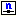

.. |img_def_Wizard_button_bmp| image:: images/Wizard_button.bmp

.. _Model-Explorer_Creating_a_Node:

Creating a Node
===============

**Description** 

To create a new node identifier in the Model Tree:

1.	Select the position in a Declaration Section where the new node identifier should be inserted

2.	From the Edit menu select Insert – Other (or press the ``<Insert>``  key)

3.	In the dialog box select |img_def_Identifier_Node_bmp| Node and press OK

4.	Enter a name for the new node identifier (if you are creating a multi-dimensional node, you can type the indices of each dimension as well)

5.	Press ``<Enter>``  to create the new node (or press ``<Esc>``  to abort the operation)

The newly created node is not yet ready for use, because you should at least specify some mandatory attributes. To modify the attributes of the newly created node identifier:

*	Press ``<Enter>``  or double click on the node identifier node.

The most commonly used attributes of a node are discussed below. 

*	``INDEX DOMAIN``  : The ``INDEX DOMAIN``  attribute should be specified in order to declare indexed nodes. The |img_def_Wizard_button_bmp| wizard will display the Set Dependency Tree of your model and allows you to select one or more indices.
*	``UNIT``  : The ``UNIT``  attribute is used to specify the unit in which the node's value is measured. By specifying a unit, AIMMS is able to perform automatic unit conversions and unit consistency checks. The |img_def_Wizard_button_bmp| wizard will let you select a unit and quantity from the list made up from your model quantities and units together with the information in the AIMMS SI unit base.
*	``PROPERTY`` : The ``PROPERTY``  attribute should be used to specify additional properties. Note that in order to retrieve sensitivity information from the solver, the ``ShadowPrices`` , ``RightHandSideRange`` , or ``ShadowPriceRange``  property should be explicitly set. The |img_def_Wizard_button_bmp| wizard will let you specify the properties through a selection of radio buttons and check boxes.
*	``DEFINITION`` : The ``DEFINITION``  attribute is mandatory and should contain the constraint formulation containing two or three expressions separated by one of the relational operators ``=`` , ``<=`` , or ``>=`` . The predefined AIMMS variables ``NetInflow``  and ``NetOutflow``  can be used in this expression to denote net input and net outflow for the current node.

**Remark** 

Nodes are used to formulate network models and are considered to be constraints when it comes to solving the network model. 

**Learn more about** 

*	:ref:`sec:net.node` 
*	:ref:`aimmshelp6-Model_Explorer_Attribute_Forms`  
*	:ref:`Model-Explorer_Attribute_Form_Manipulation`  

