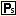

.. _Model-Explorer_Creating_a_String_Parameter:

Creating a String Parameter
===========================

**Description** 

To create a new string parameter in the Model Tree:

1.	Select the position in a Declaration Section where the new string parameter should be inserted

2.	From the Edit menu select Insert – Other (or press the ``<Insert>``  key)

3.	In the dialog box select |img_def_Identifier_String_Parameter_bmp| String parameter and press OK

4.	Enter a name for the new string parameter (if you are creating a multi-dimensional parameter, you can type the indices of each dimension as well)

5.	Press ``<Enter>``  to create the new string parameter (or press ``<Esc>``  to abort the operation)

The newly created string parameter is now ready for use, but you probably want to specify some additional attributes. To modify the attributes of the newly created string parameter:

*	Press ``<Enter>``  or double click on the string parameter.

The most commonly used attributes of a string parameter are discussed below.

*	``INDEX DOMAIN``: The ``INDEX DOMAIN`` attribute should be specified in order to declare indexed string parameters. The |img_def_Wizard_button_bmp| wizard will display the Set Dependency Tree of your model and allows you to select one or more indices.
*	``DEFAULT``: The ``DEFAULT`` attribute should be used in order to specify a default value other than the empty string. Note that AIMMS will explicitly store all values that are non-default. 
*	``DEFINITION``: The ``DEFINITION`` attribute can (and should) be used to specify the definition of an identifier by means of a global relationship. AIMMS stores the result of a definition and recomputes it only when necessary.

**Learn more about** 

*	:ref:`string_parameter` 
*	:ref:`aimmshelp6-Model_Explorer_Attribute_Forms`  
*	:ref:`Model-Explorer_Attribute_Form_Manipulation`  

