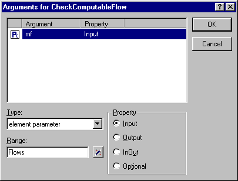

.. _Model-Explorer_Argument_Wizard:

Argument Wizard
===============

**Description** 

All function and procedure arguments must be declared as local identifiers in a declaration section local to the function or procedure. These local declarations then specify the further domain and range information of the arguments. Whenever an argument has not been declared when you create or modify a function or procedure, AIMMS will present the Argument Wizard to help you add these declarations quickly and easily to the function or procedure node in the Model Tree. If necessary, AIMMS will automatically add a declaration section to the function or procedure, and add the arguments displayed.

|img_def_Argument_Wizard_bmp| 

The Argument Wizard is activated when

*	you specify a new function or procedure with arguments, or
*	you change the prototype of an existing function or procedure.

The Argument Wizard allows you to specify the

*	Identifier type, and
*	Input-output property of the arguments.

