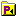
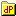
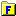
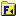

.. _Model-Explorer_Procedure_and_Function_Nodes:

Procedure and Function Nodes
============================

**Description** 

A frequently occurring node type is the declaration of a procedure or a function. Such a procedure or function node contains the data retrieval statements, computations, and algorithms that make up the procedural execution of your modeling application. The icons that are associated with the function and procedure nodes will open when the procedure or function node is expanded. They can be inserted in the Model Tree in either the root node or in any book section. Procedure and function nodes may contain their own declaration sections for their arguments and local identifiers. 

The procedure and function nodes that are supported by AIMMS are

*	|img_def_Procedure_Section_bmp| (internal) procedure
*	|img_def_External_Procedure_Section_bmp| external procedure
*	|img_def_Database_Procedure_Section_bmp| database procedure
*	|img_def_Function_Section_bmp| (internal) function
*	|img_def_External_Function_Section_bmp| external function

When declaring a new procedure or function, you can immediately specify its arguments. AIMMS however requires you to declare these arguments as local identifiers as well. To help you declare these local identifiers, AIMMS will open an Argument Wizard in which you can specify for each argument the identifier type and some mandatory properties. The wizard then automatically creates these local declarations.

**Remark** 

AIMMS does not allow nested procedures or recursive procedures.

**Tips & Tricks** 

*	Inside a body of an execution or definition attribute, Argument Information about the current function or procedure is available under the right-mouse popup menu. Position the caret on the function or procedure and select the Argument Info command from the right-mouse popup menu. This will help you specify the arguments when making a function or procedure call.

**Learn more about** 

*	 Search for Creating procedure and functions(User's Guide)
*	 Search for Procedure(Language Reference)
*	 Search for External procedure(Language Reference)
*	 Search for Database procedure(Language Reference)
*	 Search for Function(Language Reference)
*	 Search for External function(Language Reference)
*	:ref:`Model-Explorer_Argument_Wizard` 

