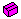

.. _Model-Explorer_Structuring_Nodes:

Structuring Nodes
=================

**Description** 

AIMMS offers three node types in the Model Tree that are mainly used for structuring the tree. These nodes create extra depth in your tree hierarchy and allow you to store related information together in a specific branch. These structuring nodes are the following

*	|img_def_Root_Node_Closed_bmp| – :ref:`Model-Explorer_Model_Explorer_-_Root_Node`  
*	|img_def_Module_Node_Closed_bmp|– :ref:`Model-Explorer_Model_Explorer_-_Module_Node`  
*	|img_def_Section_Node_Closed_bmp| – :ref:`Model-Explorer_Model_Explorer_-_Section_Node`  
*	|img_def_Declaration_Section_bmp| – :ref:`Model-Explorer_Model_Explorer_-_Declaration_S`  

