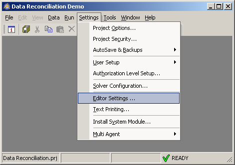

.. _Model-Explorer_me_se_ht_ChangeSettings:

Change Default colors, font or behaviour
========================================

To change default colors, font or behaviour of the editor:

1. Navigate to the Settings pane of the main menu

2. Select the Editor Settings ... item.

	|img_def_SyntaxHighlightingSettingsMenu_png|

This brings up the Editor settings form.

