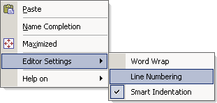

.. _Model-Explorer_me_se_ht_ToggleLineNumbering:

Toggle Line Number Margin
=========================

To toggle the current Line Number Margin status:

1. Bring up the context menu

2. Navigate to Editor Settings

3. Toggle the checkmark in front of the 'Line Number Margin' item

	|img_def_ContextMenuLineNumberMargin_png|

The default (initial) Line Number Margin status can be altered in the Editor Settings dailog.

