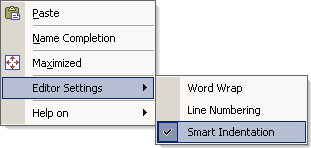

.. _Model-Explorer_me_se_ht_ToggleSmartIndent:

Toggle Smart Indent
===================

To toggle the current Smart Indent status:

1. Bring up the context menu

2. Navigate to Editor Settings

3. Toggle the checkmark in front of the 'Smart Indent' item

	|img_def_ContextMenuSmartIndent_png|

The default (initial) Smart Indent status can be altered in the Editor Settings dailog.

