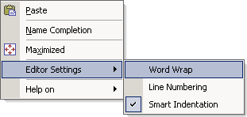

.. _Model-Explorer_me_se_ht_ToggleWordWrap:

Toggle Word Wrap
================

To toggle the current Word Wrap status:

1. Bring up the context menu

2. Navigate to Editor Settings

3. Toggle the checkmark in front of the 'Word Wrap' item

	|img_def_ContextMenuWordWrap_png|

The default (initial) Word Wrap status can be altered in the Editor Settings dailog.

