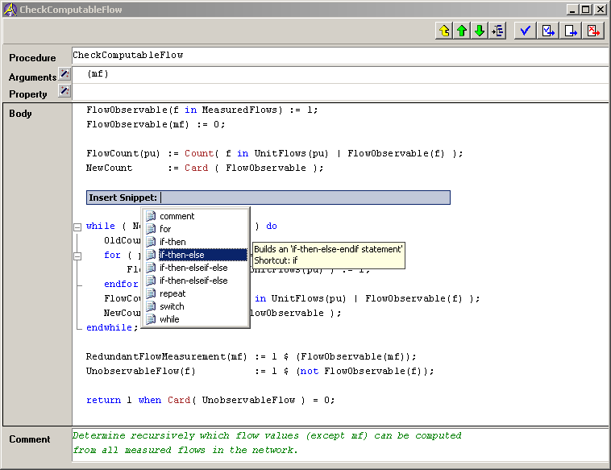

.. _Model-Explorer_me_se_ht_TriggerCodeSnippets:

Trigger Code Snippets
=====================

To trigger Code Snippets press the **Tab**  key while the cursor is at the end of one of the defined snippet shortcuts, e.g. for, while, or if.

Alternatively a list of Code Snippets can be brought up by pressing the **Number 1**  key while holding the **Control**  key (**Ctrl + 1** ). The Code Snippet can as well be applied on a selection. See :ref:`Model-Explorer_me_se_CodeSnippets`  for more information and how to create user defined snippets.

	|img_def_TriggerCodeSnippet1_png|

