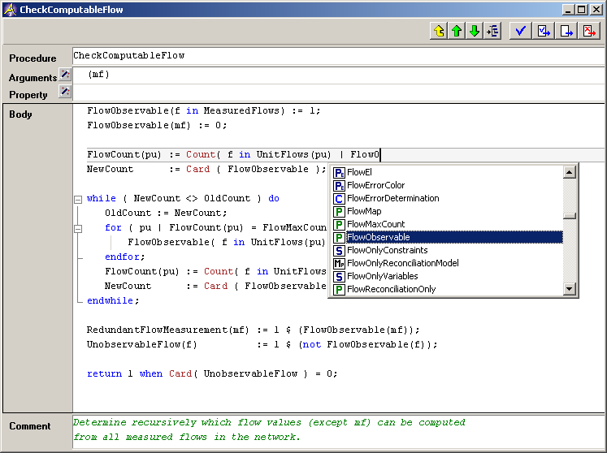

.. _Model-Explorer_me_se_ht_TriggerNameCompletion:

Trigger Name Completion
=======================

To explicitly trigger Name Completion, press the spacebar while holding the Control key and optionally the Shift key (**Ctrl (+ Shift) + Spacebar**). Name completion will automatically take place upon typing a dot ('.') or a double colon ('::').

|img_def_TriggerAutoComplete1_png|

see :ref:`Miscellaneous_Name_Completion`  for a more complete description.

