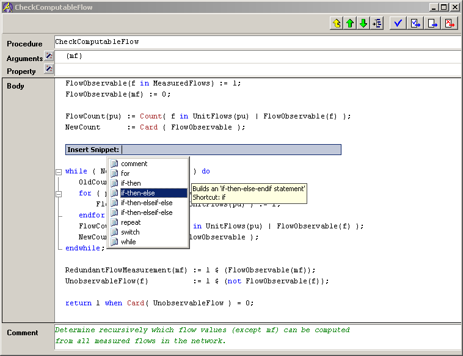
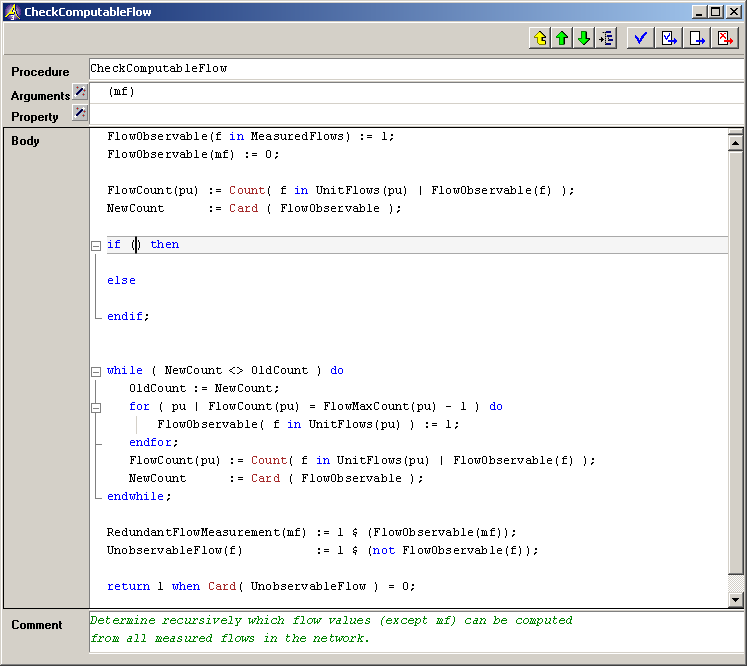

.. _Model-Explorer_me_se_CodeSnippets:

Code Snippets
=============

A code snippet is a fragment of code or text that can be stored in an XML file and reused at a later time. Code Snippets were introduced in Visual Studio .NET 2005 and have an open format. 

**Creating Code Snippets** 

Creating Code Snippets goes beyond the scope of this document, a good starting point is the online MSDN: 
`Creating and Using IntelliSense Code Snippets <https://learn.microsoft.com/en-us/>`_ or 
`Create a Basic Code Snippet <https://learn.microsoft.com/en-us/visualstudio/ide/walkthrough-creating-a-code-snippet?view=vs-2015&redirectedfrom=MSDN>`_. 
The Code Snippets provided by the installation might as well serve as an example. 
When creating Code Snippets for use with AIMMS, it is necessary to set the Language XML-attribute 
of the Code XML-element to the value Aimms. 
Next, the XML files need to stored in the Snippets subdirectory of the AIMMS installation (e.g. C:\Users\xxx\AppData\Local\AIMMS\IFA\Aimms\4.xx.x.xxx-x64\Snippets).

**Using Code Snippets** 

The Code Snippet selection menu can be brought up by pressing the **Number 1**  key while holding the **Control**  key (**Ctrl + 1** ). The desired Code Snippet can be inserted by navigating the list using the mouse or arrow keys and selecting the appropriate Code Snippet by pressing left mouse button or the enter key. Alternatively a Code Snippet can be inserted by typing the shortcut of the Code Snippet and pressing the **Tab**  key. Valid shortcuts are e.g. for or while or if.

**Example:**  

Before insert the code snippet

	|img_def_TriggerCodeSnippet1_png|

After inserting the code snippet

	|img_def_TriggerCodeSnippet2_png|

