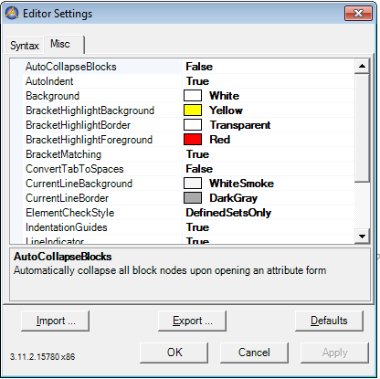

.. _Model-Explorer_me_se_set_MiscTab:

Misc Tab
========

The Editor Settings Misc tab

	|img_def_SyntaxHighlightingSettingsMisc_png|

Various **Global**  and **Initial** settings can be altered here.

Global settings are settings that are immediately applied and are valid for all edit controls.

	

.. list-table::

   * - Background
     - The default background color
   * - BracketHighlightBackground
     - The color to use when drawing the background of a highlighted bracket
   * - BracketHighlightBorder
     - The color to use when drawing the border of a highlighted bracket
   * - BracketHighlightForeground
     - The color to use when drawing the foreground of a highlighted bracket
   * - BracketMatching
     - Whether to show the matching brackets
   * - ConvertTabToSpaces
     - Whether to convert tabs to spaces when the Tab keys is pressed
   * - CurrentLineBackground
     - The color to use when drawing the background of the current line
   * - CurrentLineBorder
     - The color to use when drawing the border of the current line
   * - Foreground
     - The default foreground color
   * - IndentationGuides
     - Whether to show the indentation guides
   * - LineIndicator
     - Whether to show the current line indicator
   * - TabWidth 
     - The number of spaces that make up the tab width
   * - AutoIndent
     - Automatically indent on new line
   * - LineNumberMargin
     - Whether to show the line number margin
   * - WordWrap
     - Whether to perform word wrapping
   * - TabActivatesSnippets
     - Whether to activate a code snippet when pressing the tabkey after typing the shortcut
   * - AutoCollapseBlocks
     - Automatically collapse all block nodes upon opening an attribute form
   * - ElementCheckStyle
     - How to check the validity of literal elements

	

