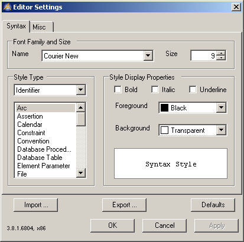
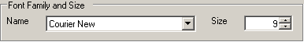
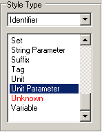
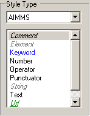
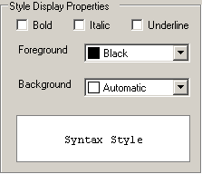
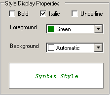

.. _Model-Explorer_me_se_set_SyntaxTab:

Syntax Tab
==========

The Editor Settings Syntax Tab:

	|img_def_SyntaxHighlightingSettingsSyntax_png|

On this tab one can change the way the editor presents (e.g. highlights) text on the screen using a syntactical analysis of that text.

The Font Family and Size group:

	|img_def_SyntaxHighlightingSettingsFont_png|

allows changing the font and size used to render the text on the screen. The specified font family and size is used for all edit controls in the attribute form. The Syntax Style Preview will display the currently selected font and size, in conjunction with the currently selected Style Type.

NB: Not all fonts have italic, bold and underline styles besides their normal styles. These fonts are not shown as a precaution; it turns out however that some fonts lie about their ability to display all the styles. Care should be taken if a highlight style (see below) uses a font-style that is not really supported by the selected font.

The Style Type group

	|img_def_SyntaxHighlightingSettingsStyleSelect_png|	|img_def_SyntaxHighlightingSettingsStyleSelect2_png|

consists of a combo box with which one selects the current category of styles and list box that enumerates the possible syntactic/semantic style types. The Identifier category will enumerate a list of identifier types that can be assigned a coloring scheme independently. 

The most notable (virtual) Identifier type is the Unknown Type. The Unknown type is given to tokens that should be an identifier (syntactically) but for which no symbol could be found.

 

NB, the final decision on the syntactic / semantic correctness is still the responsibility of the compiler. 'Good' colors do not necessarily mean a correct compilation nor vice versa.

In the AIMMS category the AIMMS language is broken up into several token types:

*   Comment

*   Element, every element, e.g. 'Amsterdam' 

*   Functions, intrinsic functions and procedures, e.g. Sum, CreateTimeTable
*   Keywords, e.g. Read, From, In, For, While

*   Numbers, every literal number, e.g. 1, 2, 4.0, 3.14
*   Operators, binary and unary operators, e.g. ``+=``, ``:=``, ``-``, ``+``, ``**``, ``..``, |
*   Punctuators, e.g. ( [ { , . ;} ] )
*   Strings, every string, e.g. "The Hague"
*   URL, (only recognized within a comment), e.g. ``https://www.aimms.com``
*   Text, everything that is specified to not be interpreted using the AIMMS syntax, e.g. the Name Attribute

The Style Display Properties group

	|img_def_SyntaxHighlightingSettingsStyleProperties_png|	|img_def_SyntaxHighlightingSettingsStyleProperties2_png|	

	

consist of three check boxes, two color-pickers and a Syntax Style preview. The pictures above show the Style Display Properties of the Text and Comment token types

