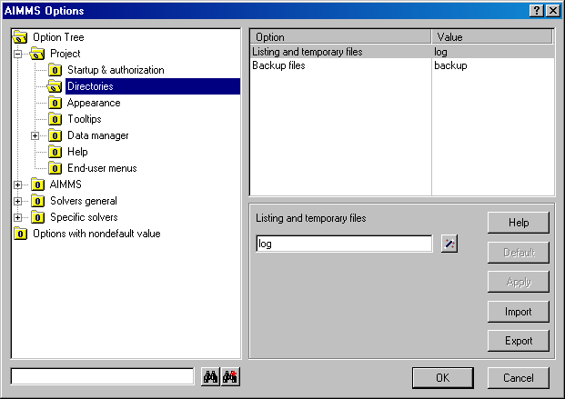

.. _Options_AIMMS_Execution_Options:

AIMMS Options
=============

**Description** 

Many aspects of the way in which AIMMS behaves during a session can be customized through the AIMMS options. 
Such options can be set globally through the options dialog box (or run time from within the model). 
As every project has its own requirements regarding AIMMS' behavior, 
option settings are stored per project in the project file. 
AIMMS offers options for several aspects of its behavior. 
Globally, the AIMMS options can be categorized as follows.

*   Project options:how does AIMMS behave during startup, and how is the appearance of AIMMS during a project.
*   Execution options:what is behavior of the AIMMS execution engine regarding numeric tolerances, reporting, 
    case management and various other execution aspects.
*   General solver options:how does AIMMS behave during the matrix generation process, and which information is listed.
*   Specific solver options:how are the specific solvers configured that are used in this project.

In the Options dialog box, an option tree lists all available AIMMS execution and solver options in a hierarchical fashion.

|img_def_AIMMS_Options_dialog_bmp| 

At the left-hand side of the dialog box, you can select the option category. 
At the right-hand side, you can select an option. You can change the value of this option, 
set the option to its default or ask help about this option. 
You can also export the options to a file or import options settings from a file. 
In the left-hand side there is an extra section with options that have a non-default value. 
At the bottom there is a possibility to type the part of an option name and search on the string in the option tree.

.. note:: 

    In addition to modifying option values in the options dialog box, 
    you can also set options run time using the OPTION statement, 
    which is discussed in the Language Reference, or with functions OptionSetValue, 
    OptionSetString, which are discussed in the Function Reference. 
    While changes to option values in the options dialog box are stored in the project file and 
    restored at the beginning of the next project session, run time option settings are lost when you close the project. 
    Setting options during run time can be convenient, however, 
    if different parts of your model need different option settings. 

**How to ...** 

*   :ref:`Options_Opening_the_Options_Dialog_Box`  
*   :ref:`Options_Opening_the_Options_Dialog_Box`  
*   :ref:`Options_Setting_an_Option_to_its_Defau`  
*   :ref:`Options_Getting_Help_about_an_Option`  

**Learn more about** 

*   :ref:`OptionSetValue`
*   :ref:`OptionSetString`
*   :ref:`option-statement`

