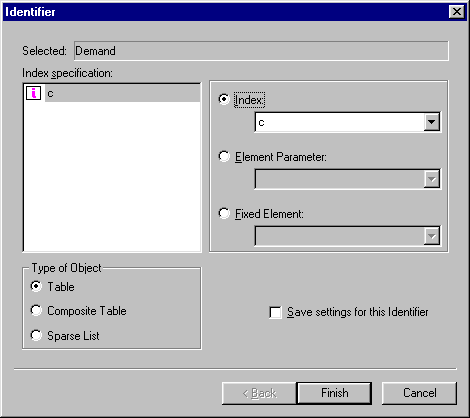

.. _Page-Manager_Construct_Identifier_Dialog_Bo:

Construct Identifier Dialog Box
===============================

**Description** 

When you click the construct |img_def_data_page_construct_button_bmp| button on a data page, the Construct Identifier dialog box will be opened.

|img_def_Data_Page_Reconstruct_Identifier_dialog_bmp| 

**Index Specification** 

For each free index in the selected identifier you can specify if an index, an element parameter, or a fixed element should be used.

**Type of Object** 

You can specify what kind of object should be used to display the data of the selected identifier. In case of an indexed identifier the possible objects are Table, Composite Table and Sparse List.

**Save Settings for this Identifier** 

You can choose to save the settings for this identifier. If you check this option, the information will be saved to a page with the name "[Data Page] <Identifier Name>" in the Page Tree. Whenever you ask data for this identifier again, AIMMS will look if this Data Page already exists in the Page Tree. If it does exist, this page will be opened.

**Learn more about** 

*	:ref:`Page-Manager_Data_Page`  
*	:ref:`Page-Manager_Page_Objects_Introduction`  

