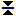

.. |img_def_Page_bmp| image:: images/Page.bmp

.. |check_mark| unicode:: U+2713
   :trim:

.. _Page-Manager_Nodes_in_the_Page_Navigation_T:

Nodes in the Page Navigation Tree
=================================

**Description** 

The Page Tree can contain different types of nodes, each representing a different type of component. Every component has its own functionality and meaning. The Page Tree can contain

*	|img_def_Root_Node_Page_Manager_bmp| a main project or library root node,
*	|img_def_Page_bmp| page nodes,
*	|img_def_pagetreereference_bmp| page tree reference nodes,
*	|img_def_Page_Separator_bmp| page separator nodes.

The following table shows the allowed parent-child relations in the Page Tree.

.. list-table::

   * - Parentchild
     - Root
     - page
     - page tree reference
     - Separator
   * - page
     - |check_mark|
     - |check_mark|
     - 
     - 
   * - page tree reference
     - 
     - |check_mark|
     - 
     - 
   * - separator
     - 
     - |check_mark|
     - 
     - 

