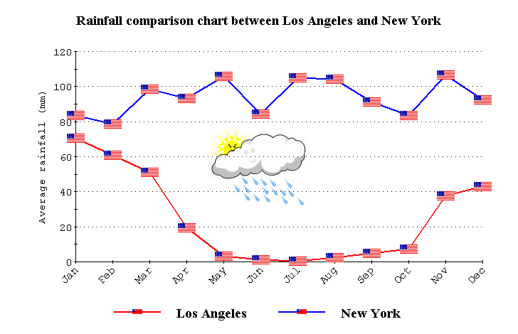

.. _2D-Chart_2D_Chart_-_Introduction:

2D Chart Introduction
======================

**Description** 

The 2D Chart ActiveX object makes it possible to display your AIMMS data in various two-dimensional chart types, such as a plot chart, a bar chart, a pie chart and many more. The object has a lot of properties that you can set, in order to adapt the look of it to your liking. Almost all properties have a default value. Therefore, only a few properties are really necessary to specify for showing your AIMMS data. 

**Necessary properties** 

In order to display your AIMMS data, you need to specify at least a domain for the X-axis and a Y-axis identifier. The first free index of this Y-axis identifier should match the X-axis domain in case of a non-scalar Y-axis identifier (it's also possible to specify a scalar Y-axis identifier). The X-axis domain can be an index, a one-dimensional parameter or a one-dimensional string parameter. In case a one-dimensional parameter is used as an X-axis domain, the X-axis will be scaled according to the values of this parameter.

There is one exception to the rule described above: the simplest form of a pie chart can be displayed by supplying just a one-dimensional Y-axis identifier and omitting the X-axis domain. 

**Module** 

Some properties require a string value to be entered, either manually or through a string parameter. For your convenience, a module has been written to help you with these properties. The module is called 'Chart2DConstantsModule.ams' and you can include this module via the menu command **Settings - Install System Module**. The module contains a number of sets, of which the elements are all valid constants for specifying the property after which the set has been named. For example, the set ``BorderTypeConstants``  in the module contains the elements ``'3D In', '3D Out', 'Bevel', 'Etched In', 'Etched Out', 'Frame In', 'Frame Out', 'None', 'Plain'``  and ``'Shadow'`` . These are the valid values for all 'Border Type' properties. Whenever one is applicable, the set of allowed values is indicated in the description of a property in this help file.

An example of a 2D chart is shown below.

|img_def_2Dchart_BMP|

**Interacting with the chart** 

When a 2D chart is displayed on an AIMMS page, you can interact with it in the following ways:

- Scale the chart by pressing CTRL, holding down both mouse buttons. Then move the mouse up to increase the size of the chart or move    the mouse down to decrease the size of the chart.

- Move the chart by pressing SHIFT and, while holding both mouse buttons down, moving the mouse.

- Zoom to an area in the chart by using CTRL and the left mouse button. Drag the mouse to pick the area to zoom on.

- Rotate the chart by holding both mouse buttons and moving the mouse up or down. Note: this will no yield an effect in every chart type.

- To reset all previous interactions: press the "R" key on the keyboard.

**How to...** 

*	:ref:`2D-Chart_Creating_a_2D_Chart`  

**Learn more about** 

*	:ref:`2D-Chart_2D_Chart_Properties`  

