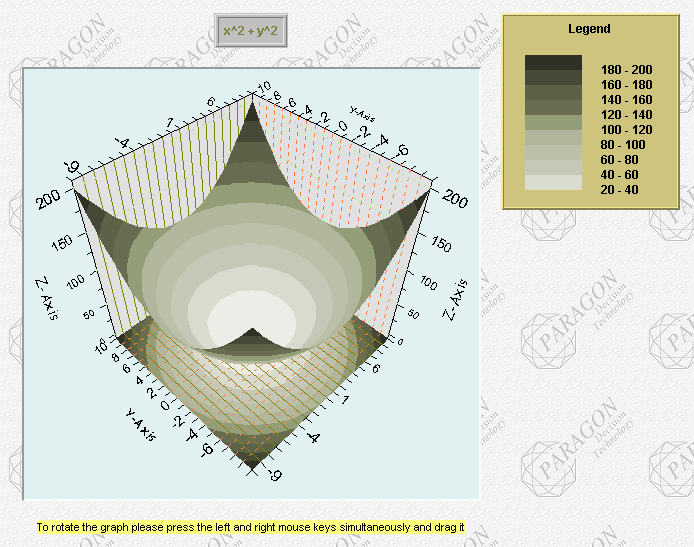

.. _3D-Chart_3D_Chart_-_Introduction:

3D Chart Introduction
========================

**Description** 

The 3D Chart ActiveX object makes it possible to display your AIMMS data in three different three-dimensional chart types: a 3D surface chart, a 3D bar chart and a 3D scatter chart. The object has a lot of properties that you can set, in order to adapt the look of it to your liking. Almost all properties have a default value. Therefore, only a few properties are really necessary to specify for showing your AIMMS data. 

**Necessary properties** 

In order to display your AIMMS data, you need to specify at least a domain for the X-axis and the Y-axis and a Z-axis identifier. When you specify a two-dimensional Z-axis identifier, make sure that the two free indices of the identifier match both the X-axis domain and the Y-axis domain. When you specify a one-dimensional Z-axis identifier, the free index should match either the X-axis domain or the Y-axis domain. A scalar Z-axis identifier is also allowed.

The X- and Y-axis domain can be indices, one-dimensional parameters or one-dimensional string parameters. In case numerical parameters are used as either the X-axis domain or the Y-axis domain, the corresponding axis will be scaled according to the values of this parameter.

**Module** 

Some properties require a string value to be entered, either manually or through a string parameter. For your convenience, a module has been written to help you with these properties. The module is called 'Chart3DConstantsModule.ams' and you can include this module via the menu command **Settings - Install System Module**. The module contains a number of sets, of which the elements are all valid constants for specifying the property after which the set has been named. For example, the set ``BorderTypeConstants``  in the module contains the elements ``'3D In', '3D Out', 'Bevel', 'Etched In', 'Etched Out', 'Frame In', 'Frame Out', 'None', 'Plain'``  and ``'Shadow'`` . These are the valid values for all 'Border Type' properties. Whenever one is applicable, the set of allowed values is indicated in the description of a property in this help file.

An example of a 3D chart is shown below.

|img_def_3Dchart_BMP|

**Interacting with the chart** 

When a 3D chart is displayed on an AIMMS page, you can interact with it in the following ways:

- Scale the chart by pressing CTRL, holding down both mouse buttons. Then move the mouse up to increase the size of the chart or move    the mouse down to decrease the size of the chart.

- Move the chart by pressing SHIFT and, while holding both mouse buttons down, moving the mouse.

- Zoom to an area in the chart by using CTRL and the left mouse button. Drag the mouse to pick the area to zoom on.

- Rotate the chart by holding both mouse buttons and moving the mouse up or down.

- To reset all previous interactions: press the "R" key on the keyboard.

**How to ...** 

*	:ref:`3D-Chart_Creating_a_3D_Chart`  

**Learn more about** 

*	:ref:`3D-Chart_3D_Chart_Properties`  

