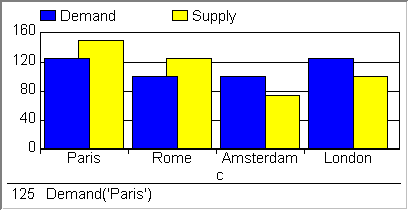

.. _Bar-Chart_Bar_Chart_Introduction:

Bar Chart Introduction
===========================

**Description** 

A Bar Chart represents model data as a graph of vertical bars. Most commonly a bar chart is used to display one-dimensional data. In that case, every element in the domain is placed along the x-axis, and a bar is drawn for every element. The height of the bars depends on the values of the identifier(s). You can create a one-dimensional bar chart by displaying:

*	A single one-dimensional identifier.
*	Multiple scalar identifiers.
*	A single scalar identifier for multiple cases.

It is also possible to display two-dimensional data in a bar chart. The elements associated with the second dimension are then displayed by stacking or grouping bars for every element along the x-axis. You can create a two-dimensional bar chart by displaying:

*	A single two-dimensional identifier.
*	Multiple one-dimensional identifiers.
*	A single one-dimensional identifier for multiple cases.
*	Multiple scalar identifiers for multiple cases.

In addition, you can add one or more horizontal lines to a bar chart. You can use these lines, for example, to display bounds or critical values for the displayed data. Every horizontal line is associated with a single scalar value in the model.

An example of a bar chart is shown below.

|img_def_Bar_Chart_Example_BMP|

**How to …** 

*	:ref:`Bar-Chart_Creating_a_Bar_Chart`  
*	:ref:`Bar-Chart_Bar_Chart_Properties_-_Content`  

**Learn more about** 

*	:ref:`Bar-Chart_Bar_Chart_Properties`  

