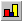

.. _Bar-Chart_Creating_a_Bar_Chart:

Create a Bar Chart
==================

To create a bar chart on a page:

1.	While in Edit Mode, select Bar Chart |img_def_Bar_Chart_button_bmp| from the Object menu.

2.	On the page, drag a rectangle where you want the bar chart to appear.

An Identifier Selection dialog box appears.

3.	Select the identifier that you want to display in the bar chart.

**Remark** 

The selected identifier (slice) can be at most two-dimensional. You can display mulitiple one-dimensional or multiple scalar identifiers in one bar chart. In that case you first have to create a bar chart for only one identifier, and add the other identifiers later, using the Contents tab of the properties dialog box.

**How to …** 

*	:ref:`Bar-Chart_Bar_Chart_Properties_-_Content`  
*	:ref:`Miscellaneous_Identifier_Selection_Dialog_Bo`  

**Learn more about** 

*	:ref:`Bar-Chart_Bar_Chart_Properties`  

