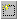

.. _Button_Action_Add_a_Page_to_a_Linked_:

Add a Page to a Linked Page(s) Action
=====================================

To add a number of pages to the list of linked pages:

1.	While in Edit Mode, open the Properties dialog box of the Object you wish to assign the action to.

2.	Change to the Action tab.

3.	Select the Linked Page(s) action from Current List of Actions where you want the page to be added to.

The Linked Page(s) dialog box appears on the right hand side of the tab.

4.	Click Create New |img_def_New_button_bmp|.

5.	The Select Page(s) dialog box appears.

6.	Select the pages you want to add.

7.	Click Ok.

