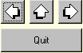

.. _Button_Button_Introduction:

Button Introduction
=====================

**Description** 

The button object allows you to let AIMMS perform one, or a series of actions. The possible actions comprise page navigation, running procedures, assertion checks, opening help topics, updating parameters and running menu commands.

Buttons allow you to set up interactive applications using your model. Buttons come in three different styles:

*	Normal text buttons, which just contain a line of text as their name.
*	Bitmap buttons, whose face is a bitmap instead of merely a line of text. 
*	Invisible buttons, which can be used to make areas of your page clickable, without actually seeing a button. In fact the button can lie on top of a drawing object, and make that object seem clickable.

Here is an example of buttons that can be used for navigation purpose.

|img_def_Button_example_bmp|

**Tips & Tricks** 

*	By placing an invisible button on a text or bitmap, you can make (part of) these objects clickable.
*	By making a button read-only, the button will be disabled. By using the read-only status of a button which has, for example, the function to solve a model, you can choose to keep this button disabled until sufficient data is entered.

**How to …** 

*	:ref:`Button_Creating_a_Text_Button` 
*	:ref:`Button_Creating_a_Bitmap_Button` 
*	:ref:`Button_Creating_an_Invisible_Button` 

**Learn more about** 

*	:ref:`Button_Button_Properties_-_Actions` 
*	:ref:`Button_Button_Properties` 

