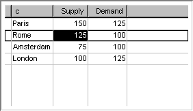

.. _Composite-Table_Composite_Table_-_Introduction:

Composite Table Introduction
=================================

**Description** 

In a Composite Table object you can display data in row-column format. It is especially useful for displaying multiple identifiers that all have the same index domain. For example, if you have three identifiers x(i), y(i) and z(i), you can easily create a Composite Table with four columns i, x, y and z; each row in the table then corresponds to an element from the domain index i, and the values of x, y, and z for that element are shown on the same row.

Usually (as in the example above), the Composite Table will display multiple one-dimensional identifiers and the domain of the Composite Table (i.e. the rows) then corresponds to an index set. You can also create a Composite Table that contains multi-dimensional identifiers. In that case the domain of the Composite Table cannot correspond to a single index set, but it must be defined via a domain identifier. This domain identifier is a multi-dimensional identifier in which every element (tuple) that has a non-default value corresponds to a row in the table.

The Composite Table is a very convenient object for the end-user, because it allows him to sort the rows based on the values in a column, change the width of a column or even rearrange the sequence of columns. The Composite Table object is therefore favorable over the table object in any of the following situations:

*	You only want to display one-dimensional identifiers.
*	You want to be able to sort the displayed data based on the current values.
*	You want to display multi-dimensional data via a compact list that only shows the current non-default values.

An example of a Composite Table is shown below.

|img_def_composite_table_example_bmp| 

**Tips & Tricks** 

*	The Composite Table can display exactly the same data as a Sparse List object. If you create a Sparse List for an identifier x(i), then you can get a similar result by creating a Composite Table with as domain identifier x(i) (note that this will result in the automatic creation of a first column with identifier x(i) as well)

**How to …** 

*	:ref:`Composite-Table_Creating_a_Composite_Table`  
*	:ref:`Composite-Table_Composite_Table_Properties_-_1`  

**Learn more about** 

*	:ref:`Composite-Table_Composite_Table_Properties`  
*	:ref:`Composite-Table_Composite_Table_Properties_-_1`  
*	:ref:`Composite-Table_Composite_Table_Properties_-_I`  
*	:ref:`Composite-Table_Sorting_Data_in_a_Composite_Ta`  
*	:ref:`Composite-Table_Adding_Modifying_and_Removing_`  

