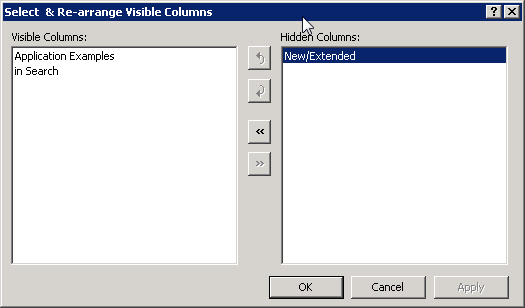

.. _Composite-Table_Hiding_and_rearranging_columns_CompositeTable:

Hiding and re-arranging columns in a Composite Table
====================================================

**Description** 

In a composite table, the end-user can change the order in which the columns are displayed and also choose to hide some of the columns.

Changing the order can be done in two ways:

#.   By simply dragging the header of a column to a new position.
#.   By right-clicking the mouse in the header bar of the composite table, which pops up the **Select & Re-arrange Visible Columns** dialog box.

|img_def_SelectColCompTable_jpg|

The **Select & Re-arrange Visible Columns** dialog box shows two lists: at the left you find the columns that are currently displayed in the composite table, and at the right you find the columns that are currently hidden. Using the buttons left |img_def_Add_Item_Left_Multiple_Cases_Dialog_bmp| and right |img_def_Add_Item_Right_Multiple_Cases_Dialog_bmp| you can move columns between these two lists, which shows resp. hides the column in the table.

With the buttons Up |img_def_Shift_Up_button_bmp| and Down |img_def_Shift_Down_button_bmp| you can change the order in the list at the left side, which changes the order in which the columns are displayed in the composite table.

**Note** 

*   The **Select & Re-arrange Visible Columns** dialog box only shows when the developer has checked the **Add/Remove Columns**  checkbox in the Composite Table properties.
*   The developer of the specific composite table can make sure that certain columns cannot be hidden. These columns appear in the list at the left, but when you select them, you will notice that the right |img_def_Add_Item_Right_Multiple_Cases_Dialog_bmp| button is disabled and a notification message appears in the bottom left corner of the dialog.

**Learn more about** 

*	:ref:`Composite-Table_Composite_Table_Properties_-_T`  
