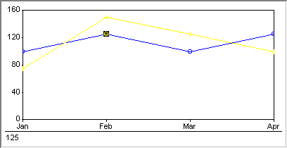
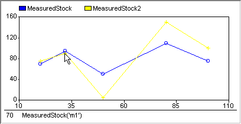

.. _Curve_Curve_Introduction:

Curve Introduction
======================

**Description** 

A Curve is an X-Y plot, and represents model data as a graph with lines and/or points. Basically, the Curve support two types of X-Y plots, which differ in how the X-coordinates are interpreted:

*	A discrete X-axis: In this type of curve a one-dimensional identifier y(i) is plotted along the Y-axis against the elements of i that are displayed along the X-axis.
*	A continuous X-axis: In this type of curve a one-dimensional identifier y(i) is plotted along the Y-axis against a second identifier x(i), which is plotted along the X-axis. So for every element in i, the corresponding point in the curve is located on the coordinate ( x(i), y(i) ). 

In a curve you can combine multiple one-dimensional Y-axis identifiers (that all have the same index domain). In this case a separate curve line is drawn for each identifier. Similarly, instead of multiple one-dimensional identifiers, you can specify one single two-dimensional identifier for the Y-axis. In this latter case, for every element in the index set, which does not match the set that is used for the X-axis, a separate curve line is drawn.

In addition to the curve lines, you can add a number of horizontal and/or vertical lines to the object, which correspond to scalar identifiers. You can use these lines, for example, to display bounds or critical values for the displayed data. 

Two examples, one of a curve with elements on the x-axis and one with a continuous range are shown below.

|img_def_CURVE_discrete_example_BMP|

|img_def_CURVE_continuous_example_BMP|

**Note** 

*	There is a limit on the number of elements that can be used in the curve with discrete x-axis: 32767.

**How to …** 

*	:ref:`Curve_Creating_a_Discrete_Curve`  
*	:ref:`Curve_Curve_Properties_-_Contents`  

**Learn more about** 

*	:ref:`Curve_Curve_Properties`  

