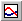

.. _Curve_Creating_a_Discrete_Curve:

Create a Discrete Curve
=======================

To create a discrete curve on a page:

1.	While in Edit Mode, select Curve |img_def_Curve_button_bmp| from the Object menu.

2.	On the page, drag a rectangle where you want the curve to appear.

The Curve dialog box appears on the screen.

3.	In the Y-Axis Identifier field, enter an identifier or select an identifier in the Identifier selection dialog box. 

4.	Under X-Axis, select Set Elements.

5.	Click Ok.

**Note** 

*	The Y-axis identifier must be either one-dimensional or two-dimensional.
*	If you select a two-dimensional identifier for the Y-axis, then by default the first free index will be used for elements along the X-axis. You can change this default via the Swap Indices option in the properties dialog box of the Curve.
*	If you select a one-dimensional Y-axis identifier here, you can add additional Y-axis identifiers later on using the Contents tab of the properties dialog box.

**How to …** 

*	:ref:`Curve_Curve_Properties_-_Contents`  
*	:ref:`Miscellaneous_Identifier_Selection_Dialog_Bo`  

**Learn more about** 

*	:ref:`Curve_Curve_Properties`  

