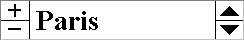

.. _Floating-Index_Floating_Index_Introduction:

Floating Index Introduction
=================================

**Description** 

With the Floating Index object you can easily browse through the elements of a set, and as a result let other objects on the page show data(-slices) that correspond to the selected element. For example, if your model contains a set of Cities, you can create a page that shows all the relevant data for one specific city and then add a Floating Index so that within this same page you can browse to each city. 

A Floating Index object can be linked to other objects in two ways:

*	Via a Forward link, selecting another element in the Floating Index results in the display of another data slice in the object (as described in the example above).
*	Via a Reverse link, selecting an entry in the linked object results in the display of another element in the Floating Index.

A Reverse link is especially useful in combination with Forward links to other object. For instance, in the example with the cities above, you can on one page combine objects that show data for a single city and objects that show data for all cities. By clicking on an entry (i.e. city) in the latter group of objects, you can make sure that the first group of objects shows the data of only that selected city. Hence, you can use other objects (besides the Floating Index itself) to select a specific element from the set.

You can use two types of identifiers in a Floating Index: a scalar element parameter or an index. You can create a similar slicing mechanism with both types of identifiers, but there are some differences in how the links with the other objects are created, and how they interact with the model.

If you use a scalar element parameter, the selected element in the Floating Index will be assigned to the parameter and you can thus use (or set) that value in your model. The link to other objects must be created within each object itself, by specifying the element parameter in the domain of the displayed identifier. In fact, you do not need the Floating Index to setup a slicing mechanism using an element parameter, because the slicing is based on the value of the element parameter, and this value can be set in any other object.

If you use an index identifier, the selected element is not assigned to any identifier in your model, so browsing through the elements will not make changes in your current data. To setup the forward or reverse links to other objects, you should use a special menu command that searches the available objects for possible links. 

|img_def_Floating_Index_example_BMP|

**Remark** 

The floating index is still available in AIMMS for compatibility with older versions. Instead of using the floating index object, please consider the use of a selection object with an element parameter. The forward link of the floating index (i.e. the element for which data is shown in an object depends on the element in the floating index), can be replaced by making a selection object with an element parameter and using this same element parameter in the Element Parameter field in the Identifier Selection Dialog box of the object. The reverse link of the floating index (i.e. when (the data of an) element is selected, this element is also shown in the floating index, can be replaced by making a selection object with an element parameter and using this element parameter in the Link Index Entry to field in the Identifier Selection Dialog box of the object. 

**Note** 

*	When you do decide to use the floating index, take into consideration the following known limitations:
*	There is a limit on the number of elements that can be shown in floating index: 32767.
*	When using the floating index with fixed elements, you can run into problems when opening the page containing the floating index while the data has not been initialized.

**How to …** 

*	:ref:`Floating-Index_Floating_Index_Creating`  
*	:ref:`Floating-Index_Floating_Index_-_Creating_a_Fo`  
*	:ref:`Floating-Index_Floating_Index_-_Creating_a_Re`  
*	:ref:`Floating-Index_Floating_Index_-_Removing_Link`  

**Learn more about** 

*	:ref:`Floating-Index_Floating_Index_Properties`  
*	:ref:`Miscellaneous_Identifier_Selection_Dialog_Bo` 

