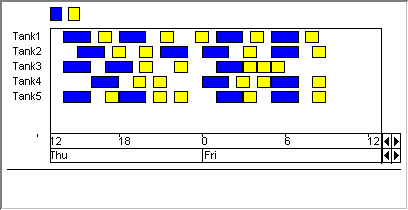

.. _Gantt-Chart_Gantt_Chart_Introduction:

Introduction
============

**Description** 

A Gantt chart is a rather complicated object, which is usually used to display and schedule a number of interrelated tasks/processes/jobs against a time scale. The Gantt chart consists of one or more rows in which a number of bars are displayed. Each individual bar represents a single task, and, because the horizontal X-axis represents a time scale, the position and length of the bar visualize when and for how long that specific task is performed. A second aspect that usually plays a role in process scheduling is the 'resource' that a specific task is using (for example, which person is performing the task). In the Gantt chart, these resources are presented as the rows of the Gantt chart. The vertical position of a bar in the Gantt chart thus visualizes the resource it is using. If your schedule involves more types of resources, then the Gantt chart offers additional features to indicate what resource is used by a task, either by using different colors, or by displaying text within each bar.

The Gantt chart in AIMMS can be used to display a specific schedule of tasks, and it offers the user a number of drag-and-drop operations to either move the bars around, or change the duration of tasks. The Gantt Chart itself does not provide any automatic scheduling options or checks on the relation between tasks; it just displays the chart based on the data from the model, and changes that data if the user modifies a task.

An example of a Gantt chart is shown below.

|img_def_Gantt_Chart_Example_BMP|

**Note** 

*   There is a limit of 32000 bars that can be shown simultaneously in a Gantt chart. If the total amount of data to be shown in the Gantt chart is larger, it is advised to use a selection object to only show part of the data at the same time.

**How to …** 

*	:ref:`Gantt-Chart_Creating_a_Gantt_Chart`  
*	:ref:`Gantt-Chart_Gantt_Chart_Properties_-_Conte`  
*	:ref:`Gantt-Chart_Gantt_Chart_-_Real-time_Calend`  

**Learn more about** 

*	:ref:`Gantt-Chart_Gantt_Chart_Properties`  
*	:ref:`Gantt-Chart_Gantt_Chart_Identifiers`  
*	:ref:`Gantt-Chart_Gantt_Chart_in_User_Mode`  
