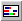

.. _Gantt-Chart_Creating_a_Gantt_Chart:

Create a Gantt Chart
====================

To create a Gantt chart on a page:

1.	While in Edit Mode, select Gantt Chart |img_def_Gantt_Chart_button_bmp| from the Object menu.

2.	On the page, drag a rectangle where you want the Gantt chart to appear.

A dialog box appears.

3.	Select the index you want to use for the row domain. (optional)

4.	Select the identifier you want to use for the legend domain. (optional)

5.	Select the identifier you want to use for the start times of the operations.

6.	Select the identifier you want to use for the duration of the operations.

7.	Select the identifier you want to use for the domain of the operations.

8.	Click Ok.

**How to …** 

*	:ref:`Gantt-Chart_Gantt_Chart_Properties_-_Conte`  

**Learn more about** 

*	:ref:`Gantt-Chart_Gantt_Chart_Properties`  
*	:ref:`Gantt-Chart_Gantt_Chart_Identifiers`  

