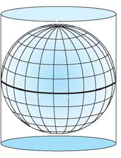
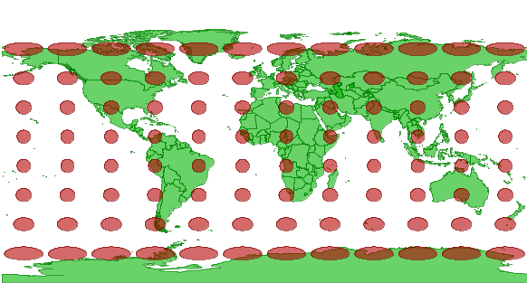
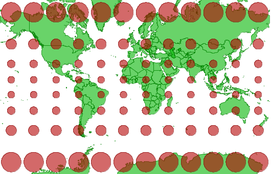

.. _Network_MapProjections:

Map Projections
===============

**Coordinate Reference System** 

During communication with an OGC server all coordinates are communicated in terms of some Coordinate Reference System (CRS). 
Such a CRS is indicated by means of the so-called EPSG parameter. 
This EPSG parameter dataset is maintained by the members of the `European Petroleum Survey Group <https://epsg.org/home.html>`_.

**Cylindrical Projections** 

AIMMS currently only supports latitude/longitude based coordinate reference systems based on a normal cylindrical projection (i.e. projections in which the meridians and parallels intersect at right angles). Commonly used cylindrical projection are the equirectangular and Mercator projection. Note that the cylindrical projections tend to show a larger distortion at areas near the poles (as can be seen from the projections below). 

  |img_def_Cylindrical_Projection_png|  

**Equirectangular Projection** 

The equirectangular projection, also referred as the equidistant cylindrical, is a very simple cylindrical projection that is corrected such that each (rectangular) grid cell has the same size, shape and area. By default, AIMMS will perform a correction for the lateral distortion by compressing the width of the map image such that distances along the meridians and parallels have the same scale (with respect to the center of the map image). This correction is applied when the center of the image is not equal to the equator such that the Tissot circles (as they appear in the pictures below) will appear as circles (instead of ellipses) on the center of the map image.

EPSG:4326

EPSG:4326 is a common equirectangular projection (based on the WGS 84 ellipsoid) that is supported by most OGC servers. For this reason EPSG:4326 is chosen as the default coordinate reference system (CRS) when rendering geographic data in AIMMS. This default CRS will do fine in almost all situations. Any other CRS has to be specified manually by the AIMMS developer. Note that most servers only support a subset of all CRS-es. 

  |img_def_Map_Projection_4326_png|

**Mercator Projection** 

The `Mercator projection <https://en.wikipedia.org/wiki/Mercator_projection>`_ is a cylindrical projection with the property for every point on the map image, the horizontal scale equals the vertical scale. This is illustrated by the fact that all Tissot circles appear as circles everywhere on the projected map. All lines with constant bearing are represented by straight lines on a Mercator projection. For this reason the Mercator projection has been very popular among (sea) navigators.

EPSG:54004

Some WMS and WFS servers also support the Mercator projection using EPSG code 54004.

  |img_def_Map_Projection_Mercator_png|

From the two world map it shows that the distortion near the poles is greater for the Mercator projection.

**Using projection in AIMMS** 

By default the WMS and WFS servers, the ESRI shape files and the local GML files produce map images using an equirectangular projection. Yahoo! Maps on the other hand produces map images using a Mercator projection. The difference between both projection is larger as a larger portion of the earth is shown. When zoomed to sufficient detailed level, both projection look similar and no much difference can be observed. Combining layers from different projection and/or superimposing arcs and nodes on a Yahoo! Map is therefore only recommended when the image cannot be zoomed out to the extent that the difference becomes too obvious and for example, the location of cities can be offset.

